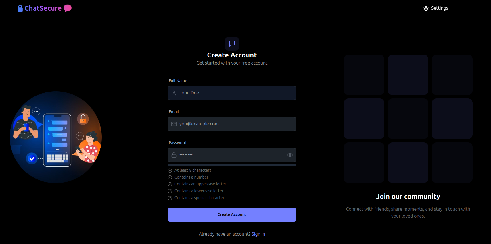
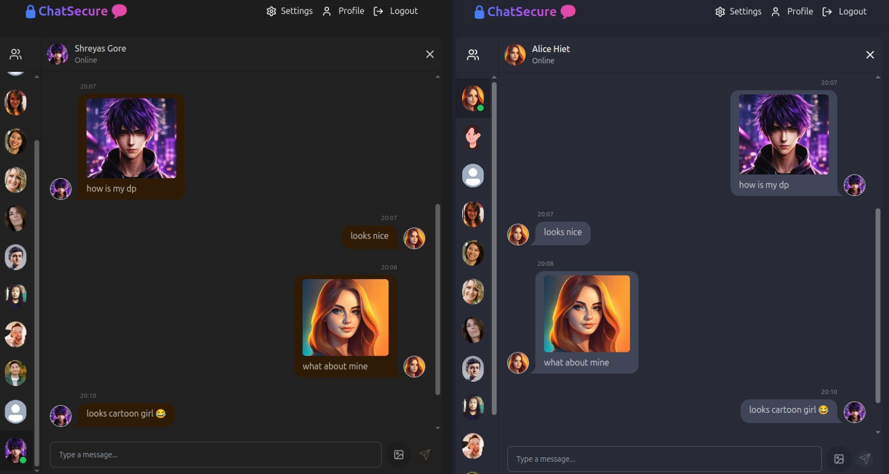

# ChatSecure: Secure Real-Time Chat Application

A secure real-time chat application focused on **privacy**, **speed**, and **robust user management**.

---

## 🚀 Key Features

- 🔐 **User Authentication & Authorization (JWT)**  
  Ensures protected access to chat features with secure token-based login.

- 🔑 **Password Security (bcrypt)**  
  Prevents credential leaks during potential database compromises.
  
- 🔒 **End-to-End Message Encryption (AES-256-CBC)**  
  Encrypts all messages before storing them in MongoDB to preserve privacy even if the database is exposed.

- 💬 **Real-Time Messaging (Socket.io)**  
  Enables seamless real-time communication between users.

- 🟢 **Online User Presence Tracking**  
  Displays real-time online/offline status of users.

- 🛡️ **Rate Limiting & Input Sanitization**  
  Protects against DDoS and NoSQL Injection attacks.

- ⚙️ **Structured Error Handling**  
  Ensures consistent error responses and improved reliability.

---

## 🛠️ Tech Stack

- **Frontend**: React.js, Tailwind CSS  
- **Backend**: Node.js, Express.js  
- **Security**: JWT, bcrypt, AES-256-CBC, rate-limiting  
- **Real-Time**: Socket.io  
- **Database**: MongoDB

---

## 📸 Screenshot

---

## 🧠 Skills Gained

- Security Best Practices (Auth, Encryption, DDoS Defense)
- Real-Time Data Communication with Sockets IO
- MongoDB Schema Design
- Client-Server Integration

---

## 📬 Contact

Feel free to reach out for collaboration or feedback!  
**Shreyas Gore** – [LinkedIn](https://linkedin.com/in/shreyas-gore)

---
